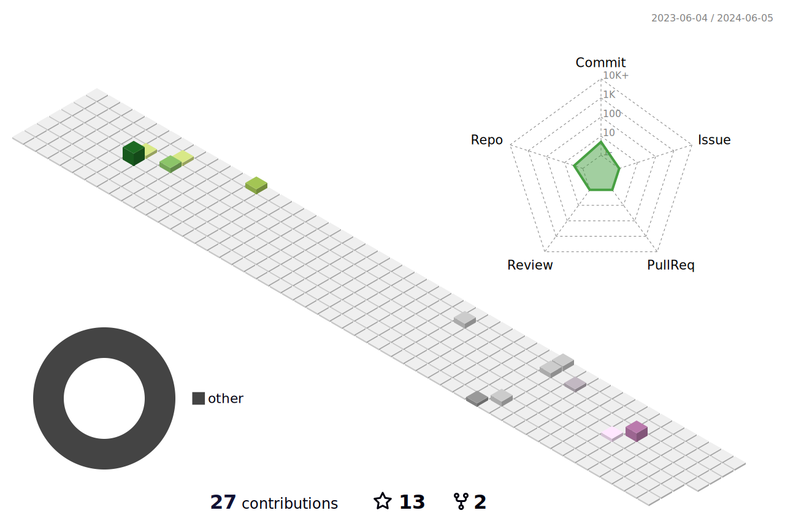

[][mail]
[][linkedin]
[][stackoverflow]
[][reddit]
[][twitter]
[][telegram]
[][youtube]
[][hackerrank]
[][epic]
[][eolymp]
[][website]
[][profile]  

  

---

</img>

### Hi, I'm a Computer Scientist, Engineer and Data Analyst 

At the start of my career and the academic path, I was obsessed with Technology, Engineering, and especially Robotics. I always thought my dream was to be an electrical and a computer engineer for a small-scaled tech company, working on an invention, soldering some lead, and working on my evil-genius side-project to conquer the world. It seemed perfect goal given my BSc in Computer Engineering. I slowly drifted towards the world of data and even started to pursue my MSc degree. And that's when the story starts; the catalyst I was missing reacted the instant I enrolled in my first professional certificate course by Google. Since then, my thirst for knowledge has not stopped.

- 🌱 &nbsp;&nbsp;&nbsp;&nbsp; I’m currently learning everything 😂
-  Check my latest youtube video: [here][vid]!
- 🏆 &nbsp;&nbsp;&nbsp;&nbsp; 2022 Goals: Develop myself more in Data science field professionally
- ❤️ &nbsp;&nbsp;&nbsp;&nbsp; Fun fact: I love coding 💻, art :art: and :video_game: games

## Contributions

[website]: https://sakhund.netlify.app
[twitter]: https://twitter.com/sadigaxund
[youtube]: https://www.youtube.com/channel/UC2gQPeLhl99dIn_xDaWeVQA
[linkedin]: https://www.linkedin.com/in/sakhund
[mail]: mailto:sadigaxund@gmail.com?subject=Github
[license]: /LICENSE
[profile]: https://github.com/sadigaxund
[vid]: https://www.youtube.com/watch?v=Gdro5uM6_o8
[epic]: https://fortnitetracker.com/profile/all/Sakhund
[eolymp]: https://www.e-olymp.com/en/users/Sakhund4634
[hackerrank]: https://www.hackerrank.com/sakhund
[stackoverflow]: https://stackoverflow.com/users/13595120/sadig-akhund
[reddit]: https://www.reddit.com/user/Sakhund
[telegram]: https://t.me/sakhund

